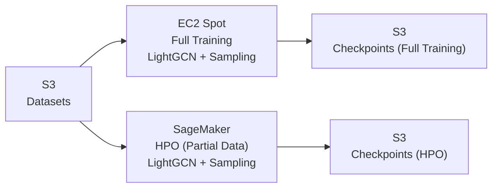

## 1. 개요
본 프로젝트는 GNN 기반 추천 시스템에서 발생하는 롱테일 아이템 학습 부족 문제를 해결하기 위해
아이템의 네트워크 중심성(DC/BC)에 기반한 Tail-Aware Negative Sampling 전략을 적용한 모델 구현 프로젝트입니다.

기존의 균일 샘플링 방식은 상위 인기 아이템에 학습이 집중되어
테일 아이템의 표현 공간이 매우 빈약해지는 문제가 있습니다.
본 연구에서는 중심성 기반 테일 샘플링을 활용하여 테일 아이템의 학습 기회를 증가시키는 것을 목표로 한다.

## 2. 특징

LightGCN 기반 임베딩 모델 구현

DC(Degree Centrality) / BC(Betweenness Centrality) 기반 아이템 중심성 계산

전체 사용자-아이템 그래프를 networkx를 통해서 아이템 기준 DC, BC 계산

Tail-aware Negative Sampling 전략 적용

Gowalla, Animation Dataset 기반 실험

PyTorch Lightning + PyTorch Geometric로 모델 구조 구현

Optuna 기반 하이퍼파라미터 튜닝 적용

EC2에서 clean environment 재현성 테스트 완료

## 3. 시스템 구조

본 학습 파이프라인은 재현 가능한 실험 환경과 확장 가능한 하이퍼파라미터 튜닝을 목표로 설계되었습니다.

사용자–아이템 상호작용 데이터와 학습 체크포인트는 Amazon S3에 저장됩니다.

모델 학습은 비용 효율성을 고려하여 EC2 Spot Instance 환경에서 수행됩니다.

하이퍼파라미터 튜닝은 Amazon SageMaker를 활용하여 자동화된 실험으로 진행됩니다.

최적 성능을 보인 모델의 체크포인트는 S3에 다시 저장하여 재사용이 가능하도록 구성했습니다.

## 4. 데이터 파이프라인

1. Amazon S3에 저장된 사용자–아이템 상호작용 데이터(Gowalla, Animation)를 로드합니다.  
2. 사용자–아이템 그래프를 구성하고 아이템의 중심성 지표(Degree / Betweenness Centrality)를 계산합니다.  
3. 학습 과정에서 롱테일 아이템을 고려한 Tail-aware Negative Sampling을 적용합니다.  
4. Amazon SageMaker를 활용하여 하이퍼파라미터 튜닝을 수행합니다.  
5. 학습된 모델의 체크포인트와 로그를 Amazon S3에 저장합니다.

## 5. 하이퍼 파라미터

데이터셋별 & 샘플링별 하이퍼파라미터

| 데이터셋    | 샘플링 방법       | lr      | embedding_dim | num_layers | batch_size   | weight_decay| epochs | dropout | alpha | omega | beta|
|------------|-----------------|---------|---------------|------------|------------|-----------|--------|---------|---------|-------|-----|
| Gowalla    | Uniform     | 0.0332  | 128           | 3          | 128        | 4.35e-06  | 100    | 0.01627 |
| Gowalla    | DC Mixed    | 0.0077  | 256           | 4          | 32         | 2.80e-06  | 100    | 0.2     | 0.7     |  1   |
| Gowalla    | BC Mixed    | 0.0028  | 256           | 2          | 64         | 1.86e-06  | 100    | 0.2     | 0.8     |  1.2 |
| Gowalla    | Hybrid DC+BC| 0.0046  | 256           | 2          | 32         | 1.18e-06  | 100     | 0.05      | 0.9. |  1.5 | 0.1
| Animation  | Uniform     | 0.0090  | 32            | 1          | 128        | 1.94e-06  | 100     | 0.23      |      |      |
| Animation  | DC Mixed    | 0.01 | 48           | 3          | 128         | 1e-06        | 100        | 0.4      | 0.6 | 1.2|

## 6. 실행 방법

docker build -t myrecsys:latest .
docker run --gpus all -it myrecsys:latest --lr 0.03316329 --embedding 128 --layer 3 --sampling dc --alpha 0.7 --omega 1

## 7. 실험 결과

#### Gowalla Dataset Results

표 1. 전체 HR/NDCG/Recall 성능 비교
| Method             | HR@20      | NDCG@20    | Recall@20  |
| ------------------ | ---------- | ---------- | ---------- |
| **Uniform**        | 0.382      | 0.0872     | 0.11       |
| **DC Mixed**       | 0.389  *(+2%)*    | 0.0891  *(+2%)*   | 0.112 *(+2%)*     |
| **BC Mixed**       | 0.4409  *(+15%)*   | 0.1071 *(+23%)*    | 0.1329 *(+21%)*    |
| **Hybrid DC + BC** | **0.4501 (+18%)** | **0.1085 (+24%)** | **0.1365 *(+24%)** |

표 2. Tail 성능 비교
| Method             | Tail HR@50       | Tail NDCG@50       | Tail Recall@50    |
| ------------------ | ---------------- | ------------------ | ----------------- |
| **Uniform**        | 0.0053           | 0.0009             | 0.0045            |
| **DC Mixed**       | 0.0064 *(+28%)*  | 0.0011 *(+22%)*    | 0.005 *(+25%)*    |
| **BC Mixed**       | 0.011 *(+22%)*   | 0.0019 *(+111%)*   | 0.008 *(+100%)*   |
| **Hybrid DC + BC** | **0.015 (+25%)** | **0.0028 (+211%)** | **0.012 (+200%)** |

표 3. Coverage 및 Long-tail Ratio 비교
| Method             | Coverage@20        | Tail Coverage@50   | Long-tail Ratio    |
| ------------------ | ------------------ | ------------------ | ------------------ |
| **Uniform**        | 0.0194             | 0.0016             | 0.0023             |
| **DC Mixed**       | 0.0216 *(+11%)*    | 0.0022 *(+38%)*    | 0.0031 *(+35%)*    |
| **BC Mixed**       | 0.0373 *(+92%)*    | 0.005 *(+155%)*    | 0.0062 *(+170%)*   |
| **Hybrid DC + BC** | **0.0476 (+145%)** | **0.0097 (+162%)** | **0.0089 (+287%)** |

#### Animation Dataset Results

표 1. 전체 HR/NDCG/Recall 성능 비교 
| Method       | HR@20        | NDCG@20        | Recall@20      |
| ------------ | ------------ | -------------- | -------------- |
| **Uniform**  | 0.66         | 0.13           | 0.16           |
| **DC Mixed** | 0.68 *(+3%)* | 0.147 *(+13%)* | 0.179 *(+12%)* |

표 2. Tail 성능 비교
| Method       | Tail HR@50      | Tail NDCG@50     | Tail Recall@50   |
| ------------ | --------------- | ---------------- | ---------------- |
| **Uniform**  | 0.0025          | 0.00021          | 0.00057          |
| **DC Mixed** | 0.0036 *(+44%)* | 0.00029 *(+38%)* | 0.00078 *(+36%)* |

표 3. Coverage 및 Long-tail Ratio 비교
| Method       | Coverage@20   | Tail Coverage@50 | Long-tail Ratio |
| ------------ | ------------- | ---------------- | --------------- |
| **Uniform**  | 0.12          | 0.055            | 0.0024          |
| **DC Mixed** | 0.14 *(+17%)* | 0.057 *(+3%)*    | 0.0019 *(−20%)* |

## 6. Animation 데이터
Animation 데이터셋은 파일 용량이 커 GitHub 저장소에는 포함하지 않았습니다.

